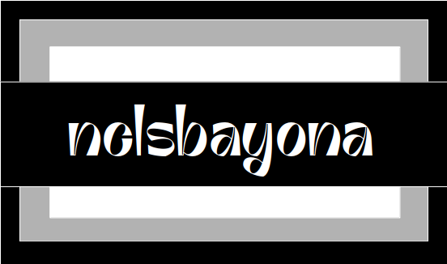

  

<h2 align="center">👋 Hey there 👋</h2>

<h3 align="center">I'm really grateful that you came here 😎</h3>

<!--p  align="center">

</p-->

  <strong align="center">Someone once said: &quot;to haga a runors een ta globo bey figaw srijab een pik&quot;</strong>
  <i>-- &quot;You make a difference in the world by simply existing in it&quot; in minion language --</i>

----

Maybe you're looking for a drink? 🍹

 
<h4 align="center">Mountain Bramble</h4>

<h5 align="center">Alcoholic - Cocktail</h5>

<h5 align="center">Necessary ingredients</h5>
<table align="center">
<tr>
<td>
<table frame="box" rules="cols">
    <thead>
        <tr>
            <th style="padding-left: 1em; padding-right: 1em; text-align: center">Ingredient</th>
            <th style="padding-left: 1em; padding-right: 1em; text-align: center">Measure</th>
        </tr>
    </thead>
    <tbody>
        <tr>
            <td style="padding-left: 1em; padding-right: 1em; text-align: center; vertical-align: top">Gin</td>
            <td style="padding-left: 1em; padding-right: 1em; text-align: center; vertical-align: top">2 oz</td>
        </tr>
        <tr>
            <td style="padding-left: 1em; padding-right: 1em; text-align: center; vertical-align: top">Lemon Juice</td>
            <td style="padding-left: 1em; padding-right: 1em; text-align: center; vertical-align: top">0.75 oz</td>
        </tr>
        <tr>
            <td style="padding-left: 1em; padding-right: 1em; text-align: center; vertical-align: top">Sugar Syrup</td>
            <td style="padding-left: 1em; padding-right: 1em; text-align: center; vertical-align: top">0.75 oz</td>
        </tr>
        <tr>
            <td style="padding-left: 1em; padding-right: 1em; text-align: center; vertical-align: top">Blackberries</td>
            <td style="padding-left: 1em; padding-right: 1em; text-align: center; vertical-align: top">Ground</td>
        </tr>
        <tr>
            <td style="padding-left: 1em; padding-right: 1em; text-align: center; vertical-align: top">Soda Water</td>
            <td style="padding-left: 1em; padding-right: 1em; text-align: center; vertical-align: top">Top</td>
        </tr>
        <tr>
            <td style="padding-left: 1em; padding-right: 1em; text-align: center; vertical-align: top">Mint</td>
            <td style="padding-left: 1em; padding-right: 1em; text-align: center; vertical-align: top">Garnish with</td>
        </tr>
        <tr>
            <td style="padding-left: 1em; padding-right: 1em; text-align: center; vertical-align: top"></td>
            <td style="padding-left: 1em; padding-right: 1em; text-align: center; vertical-align: top"></td>
        </tr>
    </tbody>
</table>
</td>
</tr>
</table>

Muddle the blackberries in a tumbler glass. Mix the Gin, lemon juice and sugar syrup in a shaker and strain over chopped ice. Top with Soda water and garnish with more blackberries and some mint

----

Maybe you're interested in learning more about my profile? 🪂

 
<h5 align="center">👀 Visitor count</h5>

----

Maybe you're interested in checking out my stats? 🐣

 
<h4 align="center">General GitHub Stats 🌀</h4>

<!--h5>😃 General Overview</h5-->

<!--h5>Life-Time Stats Overview 😃</h5-->

 

<h4 align="center">🤖 Programming Languages Stats</h4>

<!--h5>Most Used Languages Stats 💾</h5-->

 

<h4 align="center">⌚General Weekly-Stats</h4>
<table align="center">
<tr>
<td>
<table frame="box" rules="cols">
    <thead>
        <tr>
            <th style="padding-left: 1em; padding-right: 1em; text-align: center">Language name</th>
            <th style="padding-left: 1em; padding-right: 1em; text-align: center">Time spent</th>
        </tr>
    </thead>
    <tbody>
    </tbody>
</table>
</td>
<td>
<table frame="box" rules="cols">
    <thead>
        <tr>
            <th style="padding-left: 1em; padding-right: 1em; text-align: center">OS name</th>
            <th style="padding-left: 1em; padding-right: 1em; text-align: center">Time spent</th>
        </tr>
    </thead>
    <tbody>
    </tbody>
</table>
</td>
</tr>
</table>

----

Maybe you're looking to see something about our universe? 🔭

 
<h4 align="center">Time Spiral - ©️ NASA @ 2024-07-01</h4>

<h5 align="center">What's happened since the universe started? The time spiral shown here features a few notable highlights. At the spiral's center is the Big Bang, the place where time, as we know it, began about 13.8 billion years ago. Within a few billion years atoms formed, then stars formed from atoms, galaxies formed from stars and gas, our Sun formed, soon followed by our Earth, about 4.6 billion years ago.  Life on Earth begins about 3.8 billion years ago, followed by cells, then photosynthesis within a billion years.  About 1.7 billion years ago, multicellular life on Earth began to flourish.  Fish began to swim about 500 million years ago, and mammals because walking on land about 200 million years ago. Humans first appeared only about 6 million years ago, and made the first cities only about 10,000 years ago.  The time spiral illustrated stops there, but human spaceflight might be added, which started only 75 years ago, and useful artificial intelligence began to take hold within only the past few years.   Explore Your Universe: Random APOD Generator</h5>

----

Maybe you're looking for some cool animal pictures? 👁️

 
<table align="center">
<tr>
<td>

</td>
<td>

</td>
<td>

</td>
</tr>
<tr>
<td>

</td>
<td>

</td>
<td>

</td>
</tr>
<tr>
<td>

</td>
<td>

</td>
<td>

</td>
</tr>
<tr>
<td>

</td>
<td>

</td>
<td>

</td>
</tr>
<tr>
<td>

</td>
<td>

</td>
<td>

</td>
</tr>
<tr>
<td>

</td>
<td>

</td>
<td>

</td>
</tr>
<tr>
<td>

</td>
<td>

</td>
<td>

</td>
</tr>
<tr>
<td>

</td>
<td>

</td>
<td>

</td>
</tr>
</table>

----

----

<h3 align="center">Contact me! 📇</h3>

<!-- 

 !-->

 

<h3 align="center">Visit my webpage 🛸</h3>

